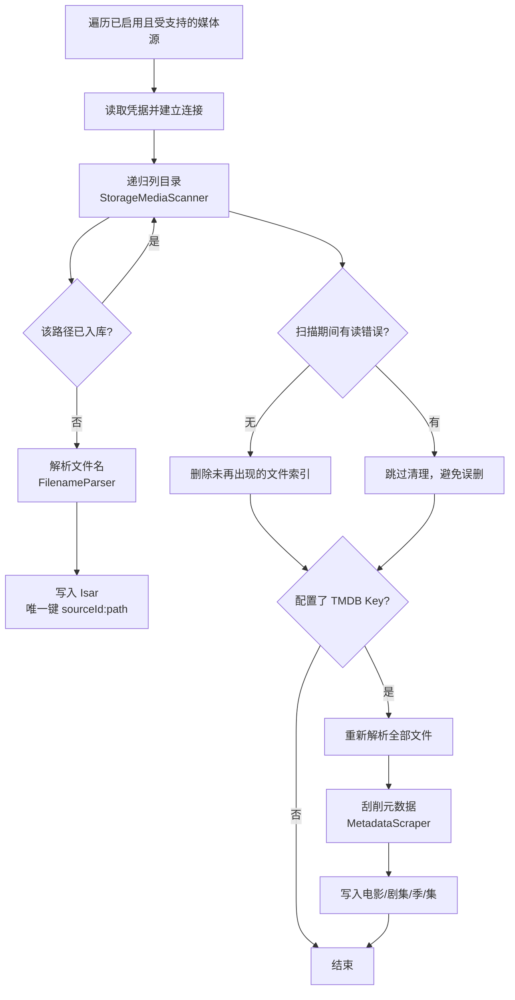

# 媒体流水线：扫描 → 解析 → 刮削 → 索引

本文描述从「配置媒体源」到「首页出现海报」的完整链路。入口是
[LibrarySyncController.scanEnabledMediaSources()](../../lib/features/library/application/library_sync_controller.dart#L107)。

## 阶段 1：扫描与入库

- 只处理 `enabled == true` 且注册表支持其类型的媒体源（[library_sync_controller.dart:124](../../lib/features/library/application/library_sync_controller.dart#L124)）。
- 连接由 `StorageProviderRegistry` 按类型分派到 `LocalStorageProvider` / `WebDavStorageProvider` / `SmbStorageProvider`；`connect` 前从仓库读取凭据，用完 `close()`。
- `StorageMediaScanner.scan()` 递归列目录，过程中任何一次目录读取失败都会置位「读错误」，从而**跳过失效文件清理**——宁可留下失效记录，也不误删整个来源（网络抖动场景）。
- 视频判定依赖扩展名白名单（[media_file_kind.dart](../../lib/core/domain/media/media_file_kind.dart)）：`mp4 mkv avi mov wmv flv webm ts m2ts mpg mpeg m4v`。
- **幂等键**：`storageKey = sourceId:path`（唯一索引）。已存在的路径直接跳过，因此增量扫描只写新增项。
- 清理：扫描成功时，删除属于该来源但本次未出现的记录。
- 扫描结束后，若配置了 TMDB，会**重新解析全部文件**并批量保存，再进入刮削。

> 注意：跳过已存在记录意味着 `size`、`versionLabel` 等技术信息不会随文件更新（换版本后仍显示旧信息）。

## 阶段 2：文件名解析

[FilenameParser.parse()](../../lib/features/library/infrastructure/filename_parser.dart) 从文件名（必要时回退到路径）提取：

| 类别 | 规则示例 |
| --- | --- |
| 季集（合并写法） | `S01E05`、`Season 1 Episode 5` |
| 仅季 | `S01`、`第X季` |
| 仅集 | `E01`、`EP01`、`第X集` / `第X话`；纯数字仅在整名即为数字时生效 |
| 季号继承 | 季号可来自父目录；只有集号时推断为第 1 季 |
| 显式 TMDB ID | `{tmdbid-12345}` / `{tmdb-12345}` |
| 年份 | 1900–2100，需带分隔符；结尾年份由路径兜底 |
| 技术信息 | 分辨率 → `height`（720p/1080p/2160p/4k/uhd）、视频编码（h264/hevc/av1 等）、音频编码（含 `DDP5.1` 内嵌声道）、声道（2.0/5.1/7.1/stereo/mono）、HDR（hdr10/hdr10+/dolby vision/dv/hlg）、来源（BluRay/WEB-DL 等） |
| 版本标签 | 由上述技术信息合成 `versionLabel`，用于同片多版本区分 |

标题清洗包含：HTML 实体解码、去掉站点前缀与「导演剪辑版 / 加长版 / 修复版 / 周年纪念版」等后缀、剔除分辨率标记与年份、通用名黑名单。解析结果经 `MediaFileMetadataMapper` 写回实体。

多版本文件**不合并**：同一 `tmdbId` 下的多个文件由查询层聚合（`getVersions`），详情页按分辨率与体积排序供用户选择。

## 阶段 3：TMDB 刮削

[metadata_scraper.dart](../../lib/features/library/infrastructure/metadata_scraper.dart) 与
[metadata_match_resolver.dart](../../lib/features/library/infrastructure/metadata_match_resolver.dart)：

1. **跳过已刮削**：以库中已有的电影 ID 与集 ID 集合过滤待处理文件；总数为 0 时不发请求。
2. **构造查询计划**：`ScrapePlanFactory` 对每个候选最多生成两轮——「标题 + 年份」与「去掉年份的标题」。
3. **匹配**：`MetadataMatchResolver` 先看显式 ID / 已确认 ID（命中则直接读本地库），否则依次尝试查询计划，**取第一个非空结果**（`TmdbSearchMatcher.findBest` 直接返回首条，注释说明以 TMDB 自身排序为准）。
4. **详情与转换**：`TmdbService` 请求详情（`append_to_response=credits,release_dates,images` 或剧集对应参数，`language=zh-CN`），由 `TmdbMetadataMapper` 转成实体。
5. **剧集**：按 `tmdb:<id>` 或规范化标题分组，逐组匹配剧集并拉取各季详情，经 `MetadataImporter.importSeasonEpisodes` 写入季与集；集 ID 形如 `show_s1e1`。
6. **并发**：`_runWithConcurrency` 以固定 worker 数（见源码 `maxConcurrent`）并行处理，进度通过回调上报（完成数 / 总数 / 成功 / 失败 / 当前标题）。
7. **未匹配**：标记为未匹配并清空 ID。

网络与代理：`TmdbClient` 统一处理 API Key、语言、超时与代理（`PROXY host:port`，不支持代理认证），图片走 `TmdbImageCacheManager`（30 天、1200 条上限，使用相同代理）。

错误处理现状：`TmdbClient.get` 捕获异常后返回 `null`，调用方无法区分「网络失败」与「没有结果」，而后续的未匹配标记会清空原有正确 ID。这是已知缺陷，处置见 [0003](../decisions/0003-persistence-migration.md) 的后续范围（网络错误应与未命中区分）。

## 阶段 4：索引与展示

| 能力 | 实现位置 | 说明 |
| --- | --- | --- |
| 内存真源与修订号 | [media_library_catalog.dart](../../lib/features/library/application/media_library_catalog.dart) | 全量列表 + 4 个修订号驱动 UI 刷新 |
| 查询投影 | [media_library_queries.dart](../../lib/features/library/application/media_library_queries.dart) | 电影、剧集、收藏、续看、多版本聚合 |
| 继续观看 | [continue_watching_resolver.dart](../../lib/core/domain/media/continue_watching_resolver.dart) | 按标题分组，剧集取「下一集/最近观看集」，按最后观看时间排序 |
| 搜索 | [library_search_matcher.dart](../../lib/features/library/application/library_search_matcher.dart) | 归一化后按精确 / 前缀 / 包含排序，同分保序 |
| 收藏 | [media_library_provider.dart](../../lib/features/library/application/media_library_provider.dart) | 标题级批量切换，作用于该标题下全部版本 |

## 已知问题

| 问题 | 影响 |
| --- | --- |
| 已入库记录不刷新 | 换版本后体积、版本标签失真 |
| 无元数据回收 | 删除文件后电影/剧集/季/集残留 |
| 全表加载 + 每次构建重算 | 大库性能；剧集列表为嵌套遍历 |
| 修订号粒度粗 | 网格只订阅元数据修订号，未配 TMDB 时扫描后可能不刷新 |
| 网络错误被当作未匹配 | 瞬时断网可能清掉正确 ID |
| 分组与标题归一化逻辑多处重复 | 修改规则需同步多个实现 |

处置见 [0003 持久化](../decisions/0003-persistence-migration.md)。
