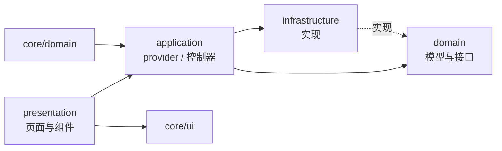
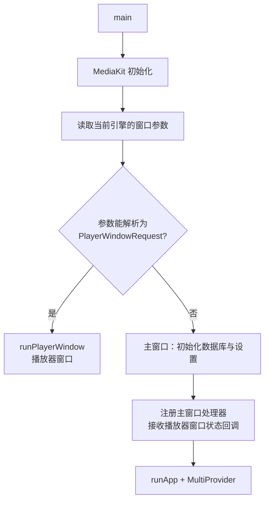

# 架构总览

本文描述**现状**（代码是怎么组织的）；要做什么改动见 [决策记录](../decisions/)。

## 分层与目录

```
lib/
├── app/        应用外壳：侧边栏、页面骨架、路由
├── core/       跨功能共享：领域模型、基础设施、设计系统、平台适配
│   ├── domain/         领域模型与接口（media / storage / playback）
│   ├── infrastructure/ 接口实现（database / storage / tmdb）
│   ├── ui/             设计系统：theme + components + formatters
│   └── platform/       平台窗口控制
├── features/   按功能划分：home / library / playback / settings
│   └── <feature>/{application,domain,infrastructure,presentation}
└── main.dart   入口，同时区分「媒体库主窗口」与「播放器窗口」
```

当前主要依赖方向：



- `presentation` 只通过 `application` 拿状态，不直接访问数据库或网络客户端。
- `infrastructure` 实现 `core/domain` 中的部分接口（如 `StorageProvider`、`PlaybackTargetResolver`）；但当前多个 `application` 类仍直接导入数据库、TMDB、存储等具体实现（例如 [library_sync_controller.dart](../../lib/features/library/application/library_sync_controller.dart)）。因此图描述的是主要依赖关系，项目尚未做到上层完全依赖接口。
- `core/` 不依赖 `features/`；跨功能的能力沉淀到 `core/`。
- 所有导入使用包路径（`package:mochi_player/...`），由 `always_use_package_imports` 强制。

## 启动流程

[main.dart](../../lib/main.dart) 用同一份入口代码区分两种窗口：



- 播放器窗口靠自己重新初始化数据库（[player_window_app.dart:379](../../lib/features/playback/presentation/player_window_app.dart#L379)），因此在同一进程内会出现两个数据库实例——这是 [0001](../decisions/0001-multi-window-strategy.md) 要消除的行为。
- 主窗口注册的处理器负责接收播放器窗口关闭时回传的进度变更（见 [playback.md](playback.md)）。

## 全局 Provider

在 [main.dart](../../lib/main.dart) 中一次性注入：

| Provider | 职责 |
| --- | --- |
| `AppSettingsProvider` | 应用设置（TMDB、缓存、字幕），并把设置应用到运行时单例 |
| `MediaLibraryProvider` | 媒体库门面：委托查询与同步控制器 |
| `FileBrowserProvider` | 文件浏览的目录、排序、搜索状态 |
| `ThemeProvider` | 主题模式与强调色（持久化在 SharedPreferences） |
| `TrendingMediaProvider` | 首页 TMDB 趋势（不落库） |
| `WindowControlsController` | macOS 原生窗口按钮控制 |

状态刷新的约定：`MediaLibraryCatalog` 是内存中的唯一数据源，改动时递增对应的**修订号**（媒体目录 / 元数据 / 观看进度 / 收藏），UI 用 `Selector` 比较修订号决定是否重建。这套机制是在弥补 `provider` 缺少派生查询能力，长期计划见 [0003](../decisions/0003-persistence-migration.md)。

## 核心抽象

| 抽象 | 位置 | 作用 |
| --- | --- | --- |
| `StorageSource` / `StorageCredentials` | [core/domain/storage](../../lib/core/domain/storage/storage_source.dart) | 媒体源配置；凭据刻意与配置分离，避免在列表中泄露 |
| `StorageProvider` / `StorageConnection` | [core/domain/storage](../../lib/core/domain/storage/storage_provider.dart) | 按协议连接与列目录；`StorageProviderRegistry` 按类型分派 |
| `PlaybackTargetResolver` / `PlaybackTarget` | [core/domain/playback](../../lib/core/domain/playback/playback_target.dart) | 把媒体文件解析成播放 URL 与请求头 |
| `DatabaseService` | [core/infrastructure/database](../../lib/core/infrastructure/database/database_service.dart) | 数据库唯一出口（单例） |
| `MediaEntityMapper` | [media_entity_mapper.dart](../../lib/core/infrastructure/database/media_entity_mapper.dart) | 实体 ↔ 领域模型转换，隔离持久化细节 |
| `TmdbService` | [core/infrastructure/tmdb](../../lib/core/infrastructure/tmdb/tmdb_service.dart) | TMDB 请求、匹配与转换（单例）；客户端由设置在运行时配置 |
| `AppTheme` + `core/ui/components` | [core/ui](../../lib/core/ui/app_ui.dart) | 设计系统：颜色、字号、间距、圆角、组件库 |

## 已知架构问题

| 问题 | 影响 | 决策 |
| --- | --- | --- |
| 一个窗口一个 Flutter 引擎 | Windows 主窗口可能无响应；两个引擎各开数据库 | [0001](../decisions/0001-multi-window-strategy.md) |
| 数据访问是全表加载 + 内存重算 | 大库性能与刷新粒度问题 | [0003](../decisions/0003-persistence-migration.md) |
| mpv 专有参数散落在业务代码 | 引擎抽象泄漏，替代方案难以评估 | [0002](../decisions/0002-playback-engine.md) |
| SMB 直链依赖预编译产物是否含某协议 | 功能可用性不可控 | [0005](../decisions/0005-smb-playback-path.md) |
| 媒体服务器包含目录浏览、播放协商与服务端会话，不能由文件系统源抽象完整表达 | 需独立的服务端接入与播放生命周期 | [0006](../decisions/0006-media-server-integration.md) |
| 无本地化工具链，文案硬编码 | Material 系统文案为英文 | [0004](../decisions/0004-i18n-l10n.md) |
