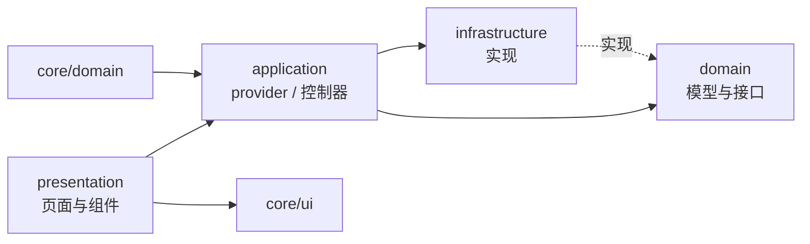
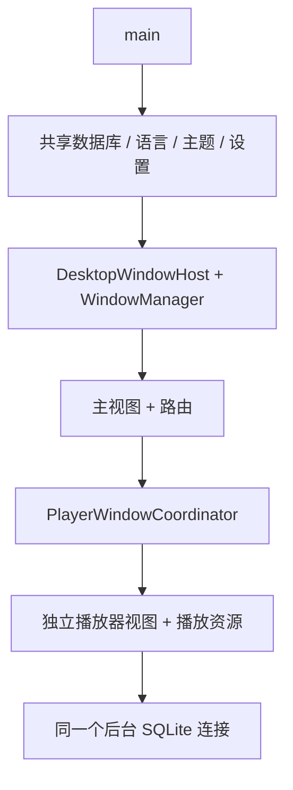

# 架构总览

本文描述**现状**（代码是怎么组织的）；要做什么改动见 [决策记录](../decisions/)。

## 分层与目录

```
lib/
├── app/        应用外壳：侧边栏、页面骨架、路由
├── core/       跨功能共享：领域模型、基础设施、设计系统、平台适配
│   ├── domain/         领域模型与接口（media / storage / playback）
│   ├── infrastructure/ 接口实现（database / storage / tmdb）
│   ├── ui/             设计系统：theme + components + formatters
│   └── platform/       平台窗口控制
├── features/   按功能划分：home / library / playback / settings
│   └── <feature>/{application,domain,infrastructure,presentation}
└── main.dart   入口，同时区分「媒体库主窗口」与「播放器窗口」
```

当前主要依赖方向：


```mermaid
graph LR
  P[presentation<br/>页面与组件] --> A[application<br/>provider / 控制器]
  A --> D[domain<br/>模型与接口]
  I[infrastructure<br/>实现] -.实现.-> D
  A --> I
  CORE[core/domain] --> A
  P --> UI[core/ui]
```

- `presentation` 只通过 `application` 拿状态，不直接访问数据库或网络客户端。
- `infrastructure` 实现 `core/domain` 中的部分接口（如 `StorageProvider`、`PlaybackTargetResolver`）；但当前多个 `application` 类仍直接导入数据库、TMDB、存储等具体实现（例如 [library_sync_controller.dart](../../lib/features/library/application/library_sync_controller.dart)）。因此图描述的是主要依赖关系，项目尚未做到上层完全依赖接口。
- `core/` 不依赖 `features/`；跨功能的能力沉淀到 `core/`。
- 所有导入使用包路径（`package:mochi_player/...`），由 `always_use_package_imports` 强制。

## 启动流程

[main.dart](../../lib/main.dart) 只运行一次：初始化 media_kit、共享数据库和设置，再通过 `runWidget` 挂载官方窗口 registry。


```mermaid
flowchart TD
  M[main] --> S[共享数据库 / 语言 / 主题 / 设置]
  S --> H[DesktopWindowHost + WindowManager]
  H --> A[主视图 + 路由]
  A --> C[PlayerWindowCoordinator]
  C --> P[独立播放器视图 + 播放资源]
  P --> DB[同一个后台 SQLite 连接]
```

- macOS / Windows runner 只创建一个 FlutterEngine、注册一次插件；窗口由 Dart 创建。
- 两个视图共享应用 Provider；`WindowService` 和窗口按钮控制器按视图注入，操作携带 `viewId`。
- 主窗口关闭先等待播放器最后进度和资源清理，再收尾任务与设置、关闭共享数据库并退出。播放器单独关闭保留主窗口与数据库。

## 全局 Provider

在 [main.dart](../../lib/main.dart) 中一次性注入：

| Provider | 职责 |
| --- | --- |
| `AppSettingsProvider` | 应用设置（TMDB、缓存、字幕），并把设置应用到运行时单例 |
| `MediaLibraryProvider` | 媒体库门面：委托查询与同步控制器 |
| `FileBrowserProvider` | 文件浏览的目录、排序、搜索状态 |
| `ThemeProvider` | 主题模式与强调色（持久化在 SharedPreferences） |
| `TrendingMediaProvider` | 首页 TMDB 趋势（不落库） |
| `AppLocaleController` | 共享语言偏好；所有视图直接观察变更 |

`WindowControlsController` 与 `WindowService` 在各自视图注入，不是全局窗口状态。每个视图拥有独立 `AppMessageHost`；提示通过调用方 context 路由，避免播放器消息出现在主窗口。

状态刷新的约定：SQLite 是持久化数据源，`LibraryRepository` 提供分页 SQL 查询与 drift 订阅。`MediaLibraryProvider` 只保留有限的首页展示投影与同步任务状态，UI 以稳定查询订阅或投影比较决定重建。全量 Catalog 与手工修订号已删除。播放器与库查询使用同一连接，进度提交直接更新 drift 查询订阅，不再发送关闭通知或手动查询失效，见 [0003](../decisions/0003-persistence-migration.md)。

## 核心抽象

| 抽象 | 位置 | 作用 |
| --- | --- | --- |
| `StorageSource` / `StorageCredentials` | [core/domain/storage](../../lib/core/domain/storage/storage_source.dart) | 媒体源配置；凭据刻意与配置分离，避免在列表中泄露 |
| `StorageProvider` / `StorageConnection` | [core/domain/storage](../../lib/core/domain/storage/storage_provider.dart) | 按协议连接与列目录；`StorageProviderRegistry` 按类型分派 |
| `PlaybackTargetResolver` / `PlaybackTarget` | [core/domain/playback](../../lib/core/domain/playback/playback_target.dart) | 把媒体文件解析成播放 URL 与请求头 |
| `DatabaseService` | [core/infrastructure/database](../../lib/core/infrastructure/database/database_service.dart) | 数据库统一出口（应用共享单例） |
| `LibraryRepository` | [library_repository.dart](../../lib/features/library/infrastructure/library_repository.dart) | SQL 查询、分页、聚合与订阅，按标题加载详情与播放队列 |
| `TmdbService` | [core/infrastructure/tmdb](../../lib/core/infrastructure/tmdb/tmdb_service.dart) | TMDB 请求、匹配与转换（单例）；客户端由设置在运行时配置 |
| `AppTheme` + `core/ui/components` | [core/ui](../../lib/core/ui/app_ui.dart) | 设计系统：颜色、字号、间距、圆角、组件库 |

## 已知架构问题

| 问题 | 影响 | 决策 |
| --- | --- | --- |
| 官方实验多视图与 main SDK | Windows 运行时与插件适配仍须验收 | [0001](../decisions/0001-multi-window-strategy.md) |
| 数据访问是全表加载 + 内存重算 | 大库性能与刷新粒度问题 | [0003](../decisions/0003-persistence-migration.md) |
| media_kit 有限维护 | 播放后端已隔离，原生渲染、捆绑构建和关键补丁仍需自行验证 | [0002](../decisions/0002-playback-engine.md) |
| SMB 直链依赖预编译产物是否含某协议 | 功能可用性不可控 | [0005](../decisions/0005-smb-playback-path.md) |
| 媒体服务器包含目录浏览、播放协商与服务端会话，不能由文件系统源抽象完整表达 | 需独立的服务端接入与播放生命周期 | [0006](../decisions/0006-media-server-integration.md) |
| 本地化已接入 gen-l10n，提供中英文与双窗口语言同步 | Windows 原生运行时与完整页面布局仍需验收；系统原生菜单语言由平台控制 | [0004](../decisions/0004-i18n-l10n.md) |

## 界面语言

`lib/l10n/` 的英文模板与简体中文译文由 gen-l10n 生成类型安全接口。`AppLocaleController` 保存 `system / zh / en` 偏好到 SharedPreferences 的 `app_language` 键，独立于 TMDB 和字幕设置；同一控制器在两个视图中共享，变更直接触发 Provider 重建，不再复制快照或使用 revision。两个 `MaterialApp` 配置同一套委托、支持语言与解析策略。

应用与控制器的用户可见错误使用 `AppFailure`，扫描 / 刮削活动使用 `LibraryActivity`；展示层根据当前 locale 翻译，服务层不依赖 `BuildContext`。日志、字幕语言匹配词及用户媒体内容不属于界面译文。生成目录不入库，CI 校验资源完整性并在静态检查 / 测试前生成。
